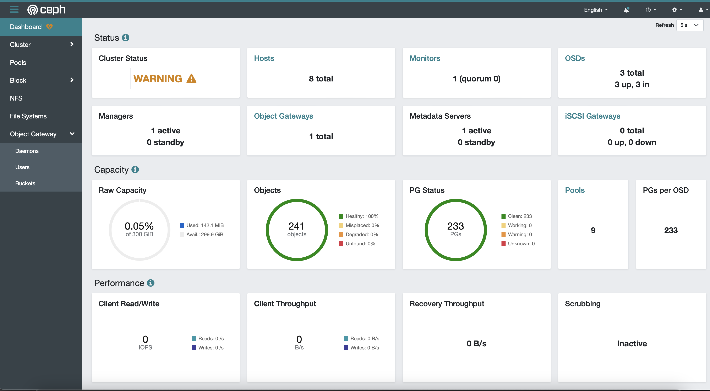

# Ceph Configuration and Deployment Scripts



This set of shell scripts is designed to simplify the configuration and deployment of a Ceph storage cluster using Docker Compose. Ceph is a distributed storage platform commonly used for large-scale storage solutions. These scripts automate the process of creating necessary directories, configuring Ceph settings, and deploying Ceph components.

## `step_one.sh`

The `step_one.sh` script performs the following tasks:

- Creates essential directories for Ceph configuration and data storage.
- Sets up directory structure for OSDs (Object Storage Daemons).

Usage:
```shell
./step_one.sh
```

After running this script, you should use Docker Compose to start the Ceph monitor and manager containers:

```shell
docker-compose up -d ceph-mon ceph-mgr
```

## `step_two.sh`

The `step_two.sh` script configures Ceph parameters in the `ceph.conf` file and adjusts pool settings for Object Storage Daemons (OSDs). It also restarts specific Ceph components to apply the changes.

Usage:
```shell
./step_two.sh
```

After running this script, create OSDs for RBD (RADOS Block Device) mirroring and other Ceph components, such as RADOS Gateway (RGW), Metadata Server (MDS), and Network File System (NFS):

```shell
# Create OSDs for RBD mirroring
docker-compose up -d ceph-osd1
docker-compose up -d ceph-osd2
docker-compose up -d ceph-osd3

# Create RGW, MDS, RBD, NFS
docker-compose up -d ceph-rgw
docker-compose up -d ceph-mds
docker-compose up -d ceph-rbd
# Create NFS
docker-compose up -d ceph-nfs
```

## `step_three.sh`

The `step_three.sh` script enables the Ceph Dashboard, sets up a self-signed certificate, and configures the dashboard's server address and port. It also creates an administrator user, an S3 user, and performs other Ceph-related configurations.

Usage:
```shell
./step_three.sh
```

After running this script, your Ceph cluster should be configured with a working Ceph Dashboard, an admin user, and an S3 user. Additionally, an S3 bucket is created, and data is synchronized to it using the `s3cmd` utility (assuming the `/etc/resources` directory exists).

These scripts are designed to streamline the setup of a Ceph storage cluster for various use cases, providing a foundation for scalable and reliable distributed storage solutions.

## Special Thanks

I would like to extend my heartfelt thanks to [Fatlan](https://github.com/fatlan) for his fantastic work on the original [Ceph-Docker-Compose](https://github.com/fatlan/Ceph-Docker-Compose) repository. This project builds upon his foundation, making it easier to configure and deploy Ceph clusters using Docker Compose. His dedication and open-source contribution are greatly appreciated.

## License
This project is licensed under the [MIT License](https://opensource.org/licenses/MIT).
